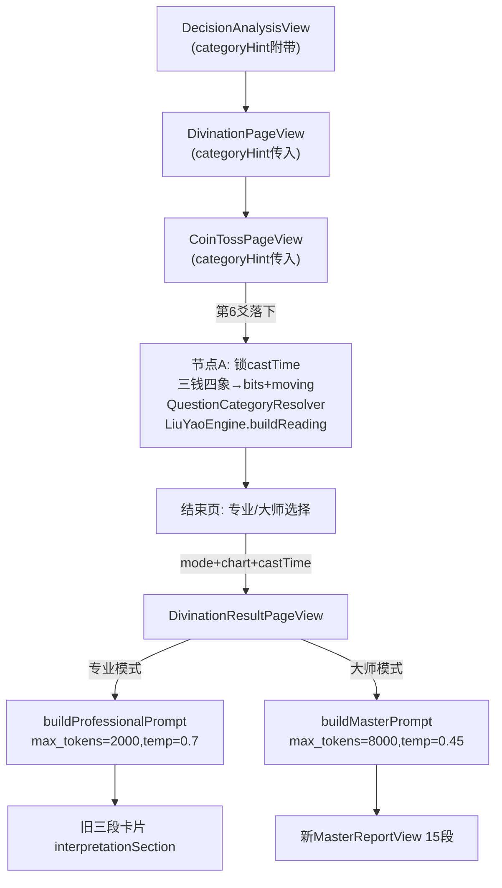

# V3.0 六爻解卦技术落地方案

## 整体数据流



---

## P0：本地引擎（先建好这一层，后面所有改动依赖它）

### 新建 `liuyao/LiuYaoEngine/` 目录，7个文件

**`LiuYaoModels.swift`** - 所有 Codable 数据结构，对齐 `hexagram-json-contract.md`

关键类型：
```swift
enum YaoXiang: String, Codable {
    case youngYang = "少阳", youngYin = "少阴"
    case oldYang = "老阳", oldYin = "老阴"
    var isYang: Bool { self == .youngYang || self == .oldYang }
    var isMoving: Bool { self == .oldYang || self == .oldYin }
}

struct LiuYaoReading: Codable { /* 对齐contract */ }
struct LiuYaoLine: Codable    { /* 每爻全字段 */ }
struct LiuYaoAssessment: Codable { /* 用神/原神/忌神/仇神 */ }
enum InterpretationMode: String, Codable { case professional, master }
```

**`LiuYaoCalendar.swift`** - `Date → LiuYaoFourPillars`，包一层已有 `LunarSwift`

核心逻辑（依赖已有 `Lunar.fromDate`）：
- 子时换日：用 `Lunar.dayInGanZhiExact`（`LunarSwift` 的 `23:00` 换日逻辑在 `Lunar.swift` 第328-338行已实现）
- 月建：用 `Lunar.monthInGanZhiExact`（节气月）
- 旬空：`LunarUtil.getXunKong(ganZhi: dayInGanZhiExact)` → 解析两字地支 → 转索引

**`LiuYaoHexagram.swift`** - 纳甲装卦，原样搬 `hexagram.py` 中的查表

移植内容：
- `NAJIA` 字典（8卦 → 内外干支串）
- `GUA64` 字典（64卦 bits → 名称）——注意：现有 `AIModels.swift` 的 `hexagrams` 用相同的 bits 方向（自下而上），但名称文字有差异，以引擎 `GUA64` 为准，改掉 `HexagramData` 的引用
- `PALACE_TABLE`（bits → 卦宫/卦型/世位）
- `castChart(bits:dayGanIndex:)` → `HexagramChart`：纳甲、六亲、六神、世应

**`LiuYaoAnalysis.swift`** - 旺衰、用神选取、空破标记，原样搬 `analysis.py`

移植内容：
- `wangshuai(yaoWuXing:monthWuXing:) → String`
- `yaoFlags(chart:monthBranch:dayZhi:xunkong:) → [LiuYaoFlags]`
- `selectYongshen(chart:category:...) → YongShenResult`
- `forceEntry(...)` 用神/原神/忌神/仇神力量评估

**`LiuYaoRelations.swift`** - 冲合关系，原样搬 `relations.py`

移植内容：
- `LIUHE`, `SANHE`, `CHANGSHENG` 查表
- `lineRelations(primary:bian:moving:dayZhi:monthBranch:)`
- `guaRelations(primary:bian:moving:)`

**`LiuYaoXingHai.swift`** - 刑害扩展层（系统自动算，不下吉凶）

```swift
// 三刑：寅巳申 / 丑戌未 / 子卯；辰午酉亥自刑
// 六害：子未/丑午/寅巳/卯辰/申亥/酉戌
struct XingHaiResult: Codable {
    var xing: [XingEntry]  // 刑关系
    var hai:  [HaiEntry]   // 害关系
}
```

**`LiuYaoEngine.swift`** - 唯一对外入口

```swift
struct LiuYaoEngine {
    static func buildReading(
        bits: String,          // 6位，自下而上
        moving: [Int: String], // {爻位1-6: "老阳"|"老阴"}
        date: Date,            // castTime，第6爻落下时刻
        category: String?,     // nil = 未分类
        question: String,
        location: String?
    ) -> LiuYaoReading
}
```

**`QuestionCategoryResolver.swift`** - 类别分类器 + 手标目录

```swift
struct QuestionCategoryResolver {
    static func resolve(question: String, hint: String?) -> (category: String?, source: CategorySource)
}
enum CategorySource: String { case catalog, keyword, unclassified }
```

包含：
- `QuestionCategoryCatalog`：约50条题库手标，Key = 题库原文，Value = 引擎类别
- `categoryKeywords`：高置信词表（见PRD §5.4）
- 冲突检测：命中≥2类别 → unclassified

### 对照测试（`liuyaoTests/LiuYaoEngineTests.swift`）

固化JSON锚点，不需要 CI 跑 Python，锚点来自 `hexagram-json-contract.md` 示例：
- 乾为天 / 申月庚寅日 / 财运 / 静卦：验证世应、纳甲、旬空、用神妻财月破
- 子时换日边界：同一问题 22:59 vs 23:00，日柱不同
- 节气交节边界：月建切换
- 有动爻变卦例

---

## P0：四态成卦（最小 UI 改动）

### 改 [`liuyao/CoinTossPageView.swift`](liuyao/CoinTossPageView.swift)

**改动1：四态生成（只改 `performNextToss` 里3行）**

原来：
```swift
let result = Bool.random()
self.tossResults.append(result)
```

改为：
```swift
let xiang = YaoXiang.randomToss()  // 三钱CSPRNG，1/8:3/8:3/8:1/8
self.yaoLines.append(xiang)
```

`YaoXiang.randomToss()` 在 `LiuYaoModels.swift` 实现：3次 `Bool.random()` 背面计数 → 映射四态。

**改动2：结果显示文本（UI 不动，只改文案）**

原来：`Text(tossResults[index] ? "阳" : "阴")`

改为：
```swift
Text(yaoLines[index].isMoving
     ? (yaoLines[index].isYang ? "阳·动" : "阴·动")
     : (yaoLines[index].isYang ? "阳" : "阴"))
```

颜色逻辑：阳用橙黄渐变（原来），阴用灰色（原来）；动爻额外一个小橙点，在文字右侧。**卡片背景/间距/动画全不动。**

**改动3：节点A（摇完后追加4行）**

在 `performNextToss` 的 `guard currentAnimationIndex < 6 else` 分支里：
```swift
// 原有：hexagramInfo = HexagramData.getHexagram(...)
// 新增在下面：
let castTime = Date()
self.castTime = castTime
let bits = yaoLines.map { $0.isYang ? "1" : "0" }.joined()
let moving = /* 从 yaoLines 提取老阳/老阴 */
let (category, source) = QuestionCategoryResolver.resolve(question: question, hint: categoryHint)
self.liuYaoChart = LiuYaoEngine.buildReading(bits: bits, moving: moving, date: castTime, category: category, question: question, location: nil)
```

新增 `@State` 属性：`castTime`, `yaoLines: [YaoXiang]`, `categoryHint: String?`, `liuYaoChart: LiuYaoReading?`

**改动4：`fullScreenCover` 传参**（现有 `DivinationResultPageView` 调用处加参数）

```swift
// 原有参数不动，新增：
interpretationMode: selectedMode == 0 ? .professional : .master,
castTime: castTime ?? Date(),
liuYaoChart: liuYaoChart,
```

**改动5：`categoryHint` 参数传入**

`CoinTossPageView` 增加 `let categoryHint: String?`（不影响现有调用，默认 `nil`）。

---

## P0：参数链（最小改动，只加参数）

### [`liuyao/DivinationPageView.swift`](liuyao/DivinationPageView.swift)

新增 `let categoryHint: String?`（init 默认 `nil`，现有调用不变）。

用户修改输入框时清空：
```swift
.onChange(of: question) { _ in
    if question != defaultQuestion { effectiveCategoryHint = nil }
}
```

向下传给 `CoinTossPageView(categoryHint: effectiveCategoryHint)`。

### [`liuyao/DecisionAnalysisView.swift`](liuyao/DecisionAnalysisView.swift)

题库点击跳转时传入：
```swift
DivinationPageView(
    currentTime: currentTime,
    locationManager: locationManager,
    defaultQuestion: question.text,
    categoryHint: question.category  // 新增一个字段
)
```

---

## P1：双模式解读接线

### 改 [`liuyao/DivinationResultPageView.swift`](liuyao/DivinationResultPageView.swift)

**改动1：init 新增参数（必传 castTime，加 mode 和 chart）**

```swift
init(
    question: String,
    tossResults: [Bool],        // 保留兼容，内部用 yaoLines
    yaoLines: [YaoXiang]? = nil,
    hexagramData: (name: String, description: String),
    currentLocation: String,
    onDismiss: @escaping () -> Void,
    isHistoryRecord: Bool = false,
    savedInterpretation: String = "",
    savedAdvice: String = "",
    castTime: Date,              // 必传，不再 ?? Date()
    interpretationMode: InterpretationMode = .professional,
    liuYaoChart: LiuYaoReading? = nil
)
```

**改动2：`requestKey` 加 mode**

```swift
private var requestKey: String {
    let hexBinary = tossResults.map { $0 ? "1" : "0" }.joined()
    return "divination_\(hexBinary)_\(abs(question.hashValue))_\(interpretationMode.rawValue)"
}
```

**改动3：`requestAIInterpretation` 按 mode 分流**

```swift
// 专业模式：原有逻辑 + 末尾附录 JSON
// 大师模式：调用新方法
let interpretation = try await aiService.interpretDivinationStream(
    question: question,
    hexagram: hexagramStruct,
    tossResults: tossResults,
    divinationTime: castTime,
    divinationLocation: currentLocation,
    mode: interpretationMode,
    chart: liuYaoChart
)
```

**改动4：`hexagramCard` 支持动爻显示**

`yaoRow(isYang:)` 增加 `isMoving: Bool` 参数，动爻爻线右侧加小橙点。**原有爻线 Capsule 样式不变。**

**改动5：大师模式报告区域**

在 `interpretationSection` 的 `else` 分支前：
```swift
if interpretationMode == .master {
    MasterReportView(rawText: aiInterpretation)
} else {
    // 原有三段卡片，不动
}
```

### 新建 `liuyao/MasterReportView.swift`

按固定标题切15段，每段对应一个卡片。切段规则：以「核心结论」「卦象档案」「专业排盘」「核心断语」「卦眼」「卦象在说什么」「方位与地域解析」「你现在处于什么局面」「为什么这样判断」「三个关键信号」「时间提示」「回到你最初的问题」「现在最值得做的事」「这卦最需要警惕什么」「最后一句」为标题锚点。

降级处理：切段失败 → 整篇 `ScrollView` + `Text`，不崩溃。

UI 复用 `ResultTheme` 和 `whiteCard` 组件，与专业模式视觉一致。

### 改 [`liuyao/AIService.swift`](liuyao/AIService.swift)

**1. 新增 `buildMasterPrompt(chart:location:) → (system: String, user: String)`**

读取 `大师模式prompt.md` 内容，按 system/user 分割：
- `system`：角色设定 + 一二三四五六节
- `user`：七、输入信息（填槽）+ 八、最终任务

填槽字段全部来自 `LiuYaoReading`；`{{context}}` 固定为空。

**2. `buildPrompt` 末尾附录排盘**（专业模式，改最后一段）

原有 prompt 末尾追加：
```
以下为本地排盘事实（禁止改写）：
\(chartJSON)
输出格式必须保持【框架解析】【问题分析】【建议指导】三段，不要改成其他结构。
```

**3. `interpretDivinationStream(mode:chart:)` 新重载**

根据 mode 选参数：
```swift
let maxTokens = mode == .master ? 8000 : 2000
let temperature = mode == .master ? 0.45 : 0.7
```

专业模式用 `user` 单角色；大师模式用 `system + user` 双角色。

**4. 年干支硬编码修复**

`buildPrompt` 里的 `"当前是2025年乙巳年，9月乙酉月"` 改为从 `castTime` 四柱派生。

---

## P2：Core Data 迁移 + 历史

### 改 Core Data Model（`DivinationModel.xcdatamodel`）

当前 `DivinationRecord` 只有：`advice, aiInterpretation, createdAt, id, question, timestamp, tossResultsData`

新增（全部 optional，保证旧记录不崩）：
- `castTime`: Date（起卦时刻）
- `interpretationMode`: String
- `engineCategory`: String
- `categorySource`: String
- `chartJSON`: Binary（`LiuYaoReading` 序列化）
- `yaoLinesData`: Binary（`[YaoXiang]` 序列化）
- `locationName`: String

### 改 [`liuyao/DataModels.swift`](liuyao/DataModels.swift)

新增便利属性：`yaoLines: [YaoXiang]`（`yaoLinesData` 编解码），`liuYaoChart: LiuYaoReading?`（`chartJSON` 编解码）。

`saveDivinationRecord` 新增参数：`castTime, mode, chart, yaoLines, category, categorySource`。

旧记录兼容：`yaoLines` 为空时从 `tossResults` 升级 Bool → 少阳/少阴。

### 改 [`liuyao/HistoryView.swift`](liuyao/HistoryView.swift) / [`HistoryPageView.swift`](liuyao/HistoryPageView.swift)

`HistoryRecordCardContent`：
- 「卦象」行：爻显示升级为四态文字（有动爻标「动」）
- 新增一个角标 Badge：`专业` / `大师`，灰色小字，放在右上角

跳转结果页时传入新参数：`castTime: record.castTime ?? record.createdAt!, mode: .., chart: record.liuYaoChart`。

---

## P2：埋点增量

在 [`liuyao/AnalyticsManager.swift`](liuyao/AnalyticsManager.swift) 的 `trackDivinationResult` 追加字段（不改事件名）：

```swift
"interpretation_mode": mode.rawValue,
"has_moving_lines":   movingCount > 0,
"moving_count":       movingCount,
"engine_category":    category ?? "unclassified",
"category_source":    source.rawValue,
"chart_build_ms":     buildDurationMs,
"ai_max_tokens":      maxTokens,
"master_section_parse_ok": parseOk
```

---

## 需你确认的 UI 改动

以下 3 处必须改 UI，但改动都很小：

1. **摇卦结束页爻显示**：在原「阴/阳」文字右侧加小橙点表示动爻。颜色用现有 `orange`，大小约 `6pt`。现有卡片布局、间距、背景不变。

2. **结果页爻卡片**：`yaoRow` 增加动爻小点，同上。

3. **历史卡片**：右上角加 `专业`/`大师` 小 Badge（灰底黑字，`caption2`，约 `4pt padding`）。

4. **大师模式结果页**：新建 `MasterReportView` 替换原来的 `interpretationSection`，共用 `ResultTheme`。这是新增视图，不改现有专业模式外观。

---

## 实施顺序

| 阶段 | 任务 | 验收标准 |
|------|------|----------|
| P0-A | `LiuYaoModels` + `LiuYaoCalendar` + `LiuYaoHexagram` + 单测锚点 | 乾为天锚点字段与契约一致 |
| P0-B | `LiuYaoAnalysis` + `LiuYaoRelations` + `LiuYaoXingHai` + `LiuYaoEngine` | 完整盘输出，用神/旺衰/冲合正确 |
| P0-C | `QuestionCategoryResolver` + 手标目录 + 黄金集测试 | 50题全中，冲突题为未分类 |
| P0-D | `CoinTossPageView` 四态出爻 + 节点A算盘 + 参数链 | 结束页能看动爻标记；castTime 稳定 |
| P1-A | `AIService` 双 prompt + token/温度分流 | 两种模式都能返回对应格式的报告 |
| P1-B | `DivinationResultPageView` 接收新参数 + requestKey 加 mode | 切模式后会重新请求 |
| P1-C | `MasterReportView` 15段切段与渲染 | 15个标题锚点都能切出来；失败降级 |
| P2-A | Core Data 迁移 + `DataModels` 新字段 | 旧记录不崩，新记录存 chartJSON |
| P2-B | 历史页升级展示 | 历史卡片显示动爻和模式标签 |
| P2-C | 埋点增量 | 新字段随 trackDivinationResult 上报 |
