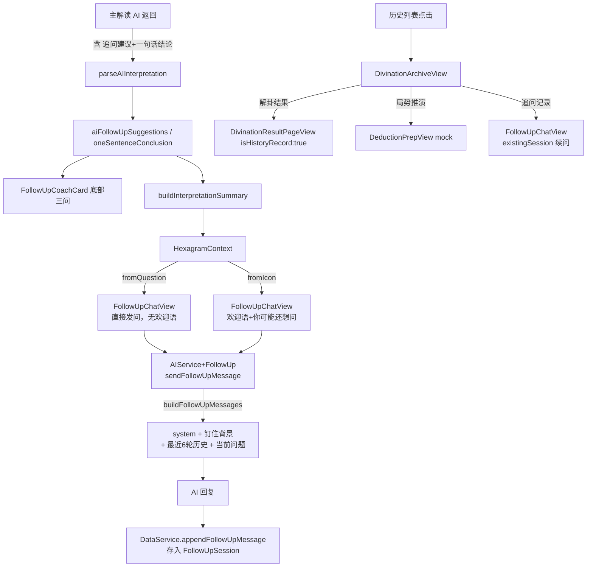

# V3.1 追问教练 + 决策档案 落地计划

## 涉及文件总览

**新增**
- `liuyao/DivinationArchiveView.swift` — 决策档案页
- `liuyao/AIService+FollowUp.swift` — 追问 AI 独立扩展
- `liuyao/DivinationModel.xcdatamodeld/DivinationModel 3.xcdatamodel/` — 新版 Core Data 模型

**重点改动**
- [`liuyao/FollowUpChatView.swift`](liuyao/FollowUpChatView.swift) — 新参数签名、入口模式、真实 AI、语音、Session 持久化
- [`liuyao/DivinationResultPageView.swift`](liuyao/DivinationResultPageView.swift) — 追问建议解析、HexagramContext 构造、入口区分
- [`liuyao/AIService.swift`](liuyao/AIService.swift) — buildPrompt 追加 `【追问建议】【一句话结论】`
- [`liuyao/LiuYaoEngine/MasterPromptTemplate.swift`](liuyao/LiuYaoEngine/MasterPromptTemplate.swift) — 同上
- [`liuyao/HistoryPageView.swift`](liuyao/HistoryPageView.swift) — 历史列表跳转目标改为 `DivinationArchiveView`
- [`liuyao/DataModels.swift`](liuyao/DataModels.swift) — FollowUpSession 扩展 + DataService 新增方法
- `liuyao/Info.plist` — 语音/麦克风权限

---

## 架构数据流



---

## Task 1 — Core Data 迁移（先做，其他 Task 依赖）

在 `DivinationModel.xcdatamodeld` 新建版本 `DivinationModel 3`：

- `DivinationRecord` 新增两个可选属性：
  - `oneSentenceConclusion`（String?）
  - `followUpSuggestionsData`（Binary?，存 `[String]` JSON）
- 新增 Entity `FollowUpSession`：
  - `id` UUID、`createdAt` Date、`updatedAt` Date
  - `messagesJSON` Binary、`totalTurns` Int16
  - relationship `divinationRecord` → `DivinationRecord`（多对一，Nullify on delete）
- `DivinationRecord` 增加反向 relationship `followUpSessions`（一对多，Cascade）
- `DataModels.swift` 新增扩展：`FollowUpSession.messages: [FollowUpChatMessage]`（JSON 序列化）
- `DataService` 新增：`createFollowUpSession`、`appendFollowUpMessage`、`fetchFollowUpSession(for:)`

---

## Task 2 — AIService+FollowUp（追问 AI 接入）

新文件 `AIService+FollowUp.swift`，内容：

```swift
// 追问 system prompt 常量（来自追问教练Prompt设计.md 二·System Prompt 完整版）
private let followUpSystemPrompt = "你是「追问教练」…"

// 构造钉住的卦象背景消息
private func buildPinnedContext(_ ctx: HexagramContext) -> String { … }

// 消息数组组装：system + 钉住背景对 + 最近12条历史 + 当前用户消息
func buildFollowUpMessages(context: HexagramContext, history: [FollowUpChatMessage], userMessage: String) -> [[String: Any]]

// 实际请求：max_tokens:350, temperature:0.65, top_p:0.9, frequency_penalty:0.3, timeout:15s
func sendFollowUpMessage(context: HexagramContext, history: [FollowUpChatMessage], userMessage: String) async throws -> String
```

`HexagramContext` 结构体放在此文件或 `AIModels.swift`：
```swift
struct HexagramContext {
    let question: String; let hexagramName: String; let hexagramDescription: String
    let oneSentenceConclusion: String; let castTime: Date; let location: String
    let interpretationSummary: String; let liuYaoChart: LiuYaoReading?
}
```

---

## Task 3 — Prompt 追加追问建议字段

**`AIService.swift` `buildPrompt()` 末尾**（在 `return prompt` 前）：

```swift
prompt += """

【一句话结论】
[用15字以内总结本次卦象最核心的判断]

【追问建议】
Q1: （从"为什么"角度，针对主要判断的依据，15字以内）
Q2: （从"时机"或"行动"角度，15字以内）
Q3: （从"结果"或"趋势"角度，15字以内）
"""
```

**`MasterPromptTemplate.swift`** 在 `【最后一句】` 段后追加同样格式的 `【一句话结论】【追问建议】` 块。

---

## Task 4 — DivinationResultPageView 改动

- 新增 `@State private var aiFollowUpSuggestions: [String] = []`
- 新增 `@State private var oneSentenceConclusion: String = ""`（从 AI 输出解析，替换 `mockOneSentenceConclusion`）
- `parseAIInterpretation()` 末尾调用 `parseFollowUpSuggestions()` 解析 Q1/Q2/Q3 和一句话结论
- 新增 `buildInterpretationSummary()` — 拼接 `oneSentenceConclusion + guidanceAdvice`，前 300 字
- 新增 `FollowUpEntryMode` 枚举 + `followUpEntryMode` State + `openFollowUpChat(mode:)` 方法
- `FollowUpCoachCard` 传入 `aiFollowUpSuggestions`；`onSelectQuestion` 改用 `.fromQuestion(preset:)` 入口
- `FollowUpEntryView` action 改用 `.fromIcon` 入口
- `fullScreenCover` 里 `FollowUpChatView` 参数换新签名，传入完整 `HexagramContext`

---

## Task 5 — FollowUpChatView 重写

**签名变更：**
```swift
FollowUpChatView(
    entryMode: FollowUpEntryMode,
    hexagramContext: HexagramContext,
    existingSession: FollowUpSession? = nil,
    onDismiss: () -> Void,
    onViewFullInterpretation: () -> Void
)
```

**`onAppear` 初始化逻辑：**
- `existingSession != nil` → 从 `messagesJSON` 还原 messages
- `entryMode == .fromIcon` → 本地预置欢迎消息（`.coach`），显示"你可能还想问"，suggestions 来自 `hexagramContext`
- `entryMode == .fromQuestion(preset:)` → 隐藏 suggestion section，0.35s 后 `send(preset)`

**`send()` 方法改为真实 AI：**
```swift
Task {
    let reply = try await AIService.shared.sendFollowUpMessage(
        context: hexagramContext, history: messages, userMessage: text)
    messages.append(.init(role: .coach, text: reply, time: .now))
    DataService.shared.appendFollowUpMessage(…)  // 持久化
    isReplying = false
}
```

**输入栏：** 删除 `photo.on.rectangle.angled` 按钮；替换为 `VoiceInputButton`（长按录音，用 `SFSpeechRecognizer` + `AVAudioEngine`，松手转文字填入 `inputText`）

**contextCard：** `Image(systemName: "text.alignleft")` 换为 `MiniHexagramView`（从 `hexagramContext.liuYaoChart` 取爻行，复用 `yaoRow` 渲染逻辑，缩小比例）

---

## Task 6 — DivinationArchiveView（新建）

参考设计图，结构：
- `NavigationView` + title "决策档案"，右侧 `···` Menu（分享/删除）
- 头部：大号问题文字 + 副标题（`oneSentenceConclusion` 或"暂无解读"）
- 基础信息卡（白色圆角卡）：卦名大字 + 起卦时间 + 解读来源 Capsule + 核心结论
- 三个功能入口卡片（垂直排列，间距 12pt）：
  - 解卦结果 → `NavigationLink` to `HistoryDetailView` (现有)
  - 局势推演 → `NavigationLink` to `DeductionPrepView` (mock，副标题写死"已推演 3 条路径")
  - 追问记录 → `NavigationLink` to `FollowUpChatView(entryMode: .fromIcon, existingSession: session)`（副标题读 `session?.totalTurns`）
- 档案动态时间轴：按 `castTime`→`createdAt`→`session.updatedAt` 生成节点列表

---

## Task 7 — 历史列表跳转改造

[`liuyao/HistoryPageView.swift`](liuyao/HistoryPageView.swift) 第 99 行附近：

```swift
// 改前
NavigationLink(destination: HistoryDetailView(record: record)) {

// 改后
NavigationLink(destination: DivinationArchiveView(record: record)) {
```

`HistoryView.swift` 同理（`HistoryDetailView` 在 NavigationLink 里的所有调用点）。

---

## Task 8 — 权限配置

`Info.plist` 新增两条 key（语音识别 + 麦克风），值为中文说明字符串。

---

## 开发顺序建议

Task 1（Core Data）→ Task 2（AIService+FollowUp）→ Task 3（Prompt）→ Task 4（结果页）→ Task 5（追问页）→ Task 6（档案页）→ Task 7（历史跳转）→ Task 8（权限）
