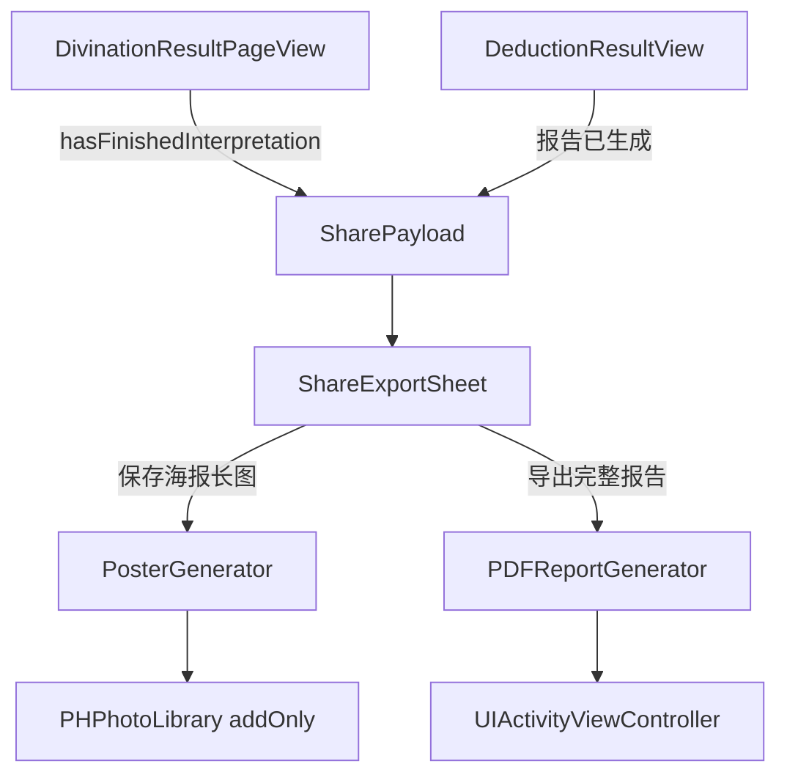

# 分享与导出功能落地计划

依据 [PRD_分享与导出功能_v1.0.md](PRD_分享与导出功能_v1.0.md)。本期只做海报 + PDF；H5 只在面板里置灰展示，不接服务端。

## 范围与不做

- **做**：分析结果页、推演结果页入口 + 底部面板 + 海报存相册 + PDF 走系统分享
- **不做**：H5 短链、微信 SDK、历史档案页的海报/PDF（档案页现有文字 `ShareLink` 保持不动）
- **系统**：[`人生教练.xcodeproj/project.pbxproj`](人生教练.xcodeproj/project.pbxproj) 的 `IPHONEOS_DEPLOYMENT_TARGET` 为 16.6 / 18.2，直接用 `ImageRenderer`，不写 UIHostingController 降级

## 架构



两页不各自实现导出逻辑。先把页面状态收成一份 `SharePayload`，海报和 PDF 都读这份数据。

## 新增文件（`liuyao/` 同步根目录，无需改 pbxproj 文件列表）

- [`liuyao/Share/SharePayload.swift`](liuyao/Share/SharePayload.swift) — 分析结果 / 推演结果的纯数据模型
- [`liuyao/Share/ShareExportSheet.swift`](liuyao/Share/ShareExportSheet.swift) — 底部分享面板
- [`liuyao/Share/PosterView.swift`](liuyao/Share/PosterView.swift) — 解卦海报 + 推演海报 SwiftUI
- [`liuyao/Share/PosterGenerator.swift`](liuyao/Share/PosterGenerator.swift) — `ImageRenderer` + 相册写入
- [`liuyao/Share/PDFReportGenerator.swift`](liuyao/Share/PDFReportGenerator.swift) — A4 PDF
- [`liuyao/Share/PhotoLibrarySaver.swift`](liuyao/Share/PhotoLibrarySaver.swift) — `addOnly` 权限
- [`liuyao/Share/ActivitySharePresenter.swift`](liuyao/Share/ActivitySharePresenter.swift) — 从当前窗口弹出系统分享（避开 `fullScreenCover` 下 `rootViewController` 失效，现有 [`DailyInspirationView.swift`](liuyao/DailyInspirationView.swift) 那种写法不能复用）

## 数据：`SharePayload`

从 [`DivinationResultPageView.swift`](liuyao/DivinationResultPageView.swift) 抽出当前页已有字段，避免海报/PDF 再去解析原文：

- 问题、卦名、卦象说明、`displayYao`、`liuYaoChart`、时间、地点、`interpretationMode`
- `resolvedConclusion`、`coreConclusionSection`、`coreVerdictSection`、`hexagramAnalysis`、`questionInterpretation`、`guidanceAdvice`、`displaySuggestions`
- 大师模式额外带上 `MasterReportParser.parse(aiInterpretation)` 的非空章节（`displayOrder`），PDF 按章节输出，空章节跳过

推演侧直接包 [`DeductionReport.swift`](liuyao/DeductionReport.swift) + `hexagramName` + `displayQuestion`。PDF 含卡片摘要 **和** 完整依据（本卦 / 动爻 / 变卦 / 世应用神 / 转折点 / 应验点），对应结果页「查看完整依据」sheet，不是只导出折叠态。

## 入口改造

**分析结果页** [`bottomActionBar`](liuyao/DivinationResultPageView.swift)（约 758 行）：在「重解」后加第三个 `outlineActionButton(icon: "square.and.arrow.up", title: "分享")`。仍受 `hasFinishedInterpretation` 控制，失败/加载中不出现。窄屏沿用现有 `minimumScaleFactor(0.8)`；若三枚描边按钮挤掉主按钮，分享改为仅图标 + `accessibilityLabel("分享")`。

**推演结果页** [`bottomBar`](liuyao/DeductionResultView.swift)（约 340 行）：中间插入描边「分享」，左右仍是「修改背景」「保存推演」。推演页进入时报告已完成，入口常显。

两页都 `.sheet(isPresented:)` 弹出 `ShareExportSheet`。

## 底部面板

按 PRD 两列卡片 + 置灰 H5 + 取消：

- 预览 **不做** 整张海报 `ImageRenderer` 缩略图（打开 sheet 会卡）。用同一套 `SharePayload` 画 130×200 的简化封面：深紫渐变 + 卦名/问题截断；PDF 侧白底封面缩略。
- 点击海报 / PDF 后卡片内 `ProgressView`「生成中…」
- H5 行置灰、不可点，文案「即将推出」
- 海报成功：`ToastManager`（已有 [`ToastView.swift`](liuyao/ToastView.swift)）「海报已保存到相册」，关 sheet
- PDF 成功：关内部 loading，弹出系统 Share Sheet；临时文件写沙盒 `Caches/`，分享结束后可删

## 海报

- 画布：`frame(width: 390)` + `ImageRenderer.scale = 3`（约 1170×2080，接近 9:16）
- 解卦海报：深紫 `#1A1033 → #3D1F7E`、复用结果页爻画法（阴阳/动爻）、卦名、问题最多 2 行、一句话结论最多 3 行、时间地点、底部「人生教练」
- 推演海报：深靛蓝、推荐 headline、进/守/退三路短句；推荐路金色标记
- 二维码：`CIQRCodeGenerator` 生成 `https://liuyao.app`（不是装饰空框）
- 无 `liuYaoChart`：爻区只放大卦名
- 权限：`PHPhotoLibrary.requestAuthorization(for: .addOnly)`；拒绝后提示去设置
- 写入：`PHAssetCreationRequest`，不要 `UIImageWriteToSavedPhotosAlbum`（C 回调难处理失败）

## PDF

`UIGraphicsPDFRenderer`，A4 `595.2 × 841.8`。长文用 `CTFramesetter` 自动分页，保证可选中文字，不要整页截图塞进 PDF。

1. 封面：人生教练 + 解卦报告/推演报告 + 问题/时间/地点/卦名 + 卦爻图 + 落款「本报告由人生教练生成」
2. 正文：空章节跳过；专业模式按 PRD 七章；大师模式按 `MasterReportParser.displayOrder`
3. 尾页：PRD 免责声明 + 生成时间 + 版本 `CFBundleShortVersionString`
4. 页眉「人生教练」+ 报告类型，页脚页码，强调色 `#935CEE`

完成后 `ActivitySharePresenter.present(fileURL:)`。

## 权限与工程配置

项目没有独立 Info.plist，权限写在 pbxproj 的 `INFOPLIST_KEY_*`。Debug / Release 两处都加：

```
INFOPLIST_KEY_NSPhotoLibraryAddUsageDescription = "liuyao.app 需要访问您的相册，以便保存海报";
```

与现有 `NSLocationWhenInUseUsageDescription` 并列。

## 埋点

在 [`SubscriptionConfig.AnalyticsEvents`](liuyao/Subscription/SubscriptionConfig.swift) 增加 PRD 8 个 eventId，[`AnalyticsManager.swift`](liuyao/AnalyticsManager.swift) 增加对应 `track*`。`source_page` 为 `divination` / `deduction`。失败带 `error_reason`（permission_denied / render_failed / save_failed / disk_full）。

## 关键复用，避免复制

- 爻画：从 `DivinationResultPageView` 抽出 `YaoStrokeView`（或内部 `yaoStroke`）给海报/PDF 封面共用，避免第三套阴阳宽度
- Toast 用已有 `ToastManager`
- 推演装饰可复用 [`DeductionMountains`](liuyao/DeductionPrepView.swift)

## 验证

- 分析结果页：专业模式完成态点分享 → 海报进相册、PDF 能发到「文件」
- 大师模式 PDF 章节齐全且空章不占页
- 解读失败 / loading：无分享入口
- 推演页：三路 + 完整依据都在 PDF 里
- 相册拒绝：引导设置，不崩溃
- 超长问题：海报截断，PDF 全文
- 无 `liuYaoChart`：海报降级为卦名
- 窄屏底部栏：分享与「推演事件趋势」不重叠
