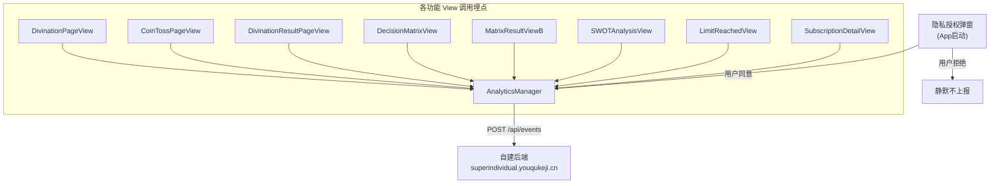

# 人生教练 App 埋点技术落地方案

## 架构总览



## 核心文件改动

### 1. 新建 `liuyao/AnalyticsManager.swift`
这是唯一的数据上报出口，其他所有文件只通过此单例调用。

核心结构：

```swift
final class AnalyticsManager {
    static let shared = AnalyticsManager()
    private var isEnabled: Bool = false

    func initialize() {
        isEnabled = UserDefaults.standard.bool(forKey: "analytics_consent")
    }

    func setEnabled(_ value: Bool) {
        isEnabled = value
        UserDefaults.standard.set(value, forKey: "analytics_consent")
    }

    func track(_ eventId: String, name: String, params: [String: Any] = [:]) {
        guard isEnabled else { return }
        // 合并用户属性 + 调用 POST /api/events
    }

    func setUserProperty(_ key: String, value: Any) { ... }
}
```

环境区分（已在 `埋点信息.md` 给出）：
```swift
#if DEBUG
private let kApiBase = "http://localhost:3000"
private let kApiKey  = "cplt_f80096..."
#else
private let kApiBase = "https://www.superindividual.youqukeji.cn"
private let kApiKey  = "cplt_eaba68..."
#endif
```

### 2. 改造 `liuyao/Subscription/SubscriptionConfig.swift`
`AnalyticsEvents` 已存在但为空壳，补全全部事件常量：

```swift
struct AnalyticsEvents {
    // 摇卦
    static let divinationClickStart  = "divination_click_start"
    static let divinationTossCoin    = "divination_toss_coin"
    static let divinationViewResult  = "divination_view_result"
    // 矩阵
    static let matrixClickNew        = "matrix_click_new"
    static let matrixSubmit          = "matrix_submit"
    static let matrixViewResult      = "matrix_view_result"
    // SWOT
    static let swotClickNew          = "swot_click_new"
    static let swotSubmit            = "swot_submit"
    static let swotViewResult        = "swot_view_result"
    // 学习/历史
    static let learningViewArticle   = "learning_view_article"
    static let profileViewHistory    = "profile_view_history"
    // 商业化
    static let limitReachedShow      = "limit_reached_show"
    static let paywallView           = "paywall_view"
    static let paywallClickBuy       = "paywall_click_buy"
    static let paywallPaySuccess     = "paywall_pay_success"
    static let paywallRestore        = "paywall_restore"
}
```

### 3. 隐私合规门控

**触发位置**：App 首次启动时（`liuyaoApp.swift` 或入口 `ContentView`）弹出同意弹窗。

逻辑：
- 检查 `UserDefaults` 是否已有 `analytics_consent` 记录
- 若无记录 → 弹出 SwiftUI Sheet/Alert，用户点「同意」后调用 `AnalyticsManager.shared.initialize()` 并 `setEnabled(true)`
- `ProfilePageView` 已有 `analyticsEnabled` toggle，改为读写 `AnalyticsManager.shared.setEnabled(_:)`

### 4. 各 View 埋点插入点

| 文件 | 事件 | 插入位置 |
|------|------|---------|
| `DivinationPageView.swift` | `divination_click_start` | 点击「开始起卦」按钮 `onTapGesture` |
| `CoinTossPageView.swift` | `divination_toss_coin` | 每次掷币动作完成回调，传入 `toss_count` |
| `DivinationResultPageView.swift` | `divination_view_result` | `.onAppear`，传入 `hexagram_name`、`wait_time_ms`、`daily_current_count` |
| `DecisionMatrixView.swift` | `matrix_click_new` | 「新建矩阵」按钮点击，传入 `scenario` |
| `DecisionMatrixView.swift` | `matrix_submit` | 「开始计算」按钮点击，传入 `options_count` |
| `MatrixResultViewB.swift` | `matrix_view_result` | `.onAppear`，传入 `has_veto`、`top_score_level` |
| `SWOTAnalysisView.swift` | `swot_click_new` | 进入 SWOT 页 `.onAppear` |
| `SWOTAnalysisView.swift` | `swot_submit` | 点击「AI深度分析」按钮 `checkPermissionAndAnalyze()` |
| `SWOTAnalysisView.swift` | `swot_view_result` | AI 返回结果展示时，传入 `wait_time_ms` |
| `LimitReachedView.swift` | `limit_reached_show` | `.onAppear`，传入 `trigger_source` |
| `SubscriptionDetailView.swift` | `paywall_view` | `.onAppear`，传入 `trigger_source` |
| `SubscriptionDetailView.swift` | `paywall_click_buy` | 购买按钮点击，传入 `plan_type`、`price` |
| `SubscriptionService.swift` | `paywall_pay_success` | StoreKit 成功回调 |
| `SubscriptionService.swift` | `paywall_restore` | 恢复购买成功回调 |

### 5. 用户属性更新时机

| 属性 | 更新位置 |
|------|---------|
| `subscription_status` | `SubscriptionService.swift` 购买/恢复/过期回调 |
| `total_divination_count` | `DivinationResultPageView.swift` `.onAppear` |
| `total_matrix_count` | `MatrixResultViewB.swift` `.onAppear` |
| `days_since_install` | App 每日首次启动（可用 `ScenePhase.active` + 日期比对） |

## 文件变更汇总

- **新建**：`liuyao/AnalyticsManager.swift`
- **改造**：`liuyao/Subscription/SubscriptionConfig.swift`（补全 `AnalyticsEvents`）
- **改造**：入口文件（隐私弹窗逻辑）
- **改造**：`liuyao/ProfilePageView.swift`（`analyticsEnabled` toggle 接入真实 Manager）
- **插入埋点调用**（只读逻辑，不改架构）：上表列出的 8 个 View 文件 + `SubscriptionService.swift`
